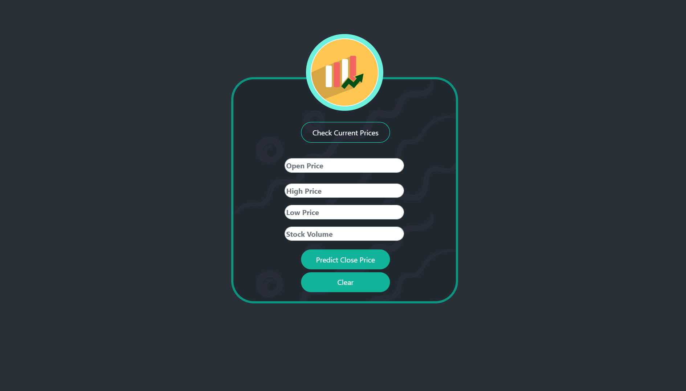
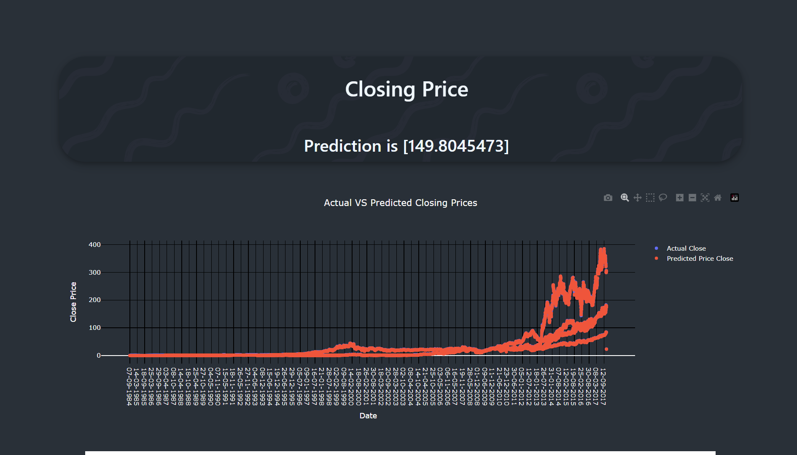
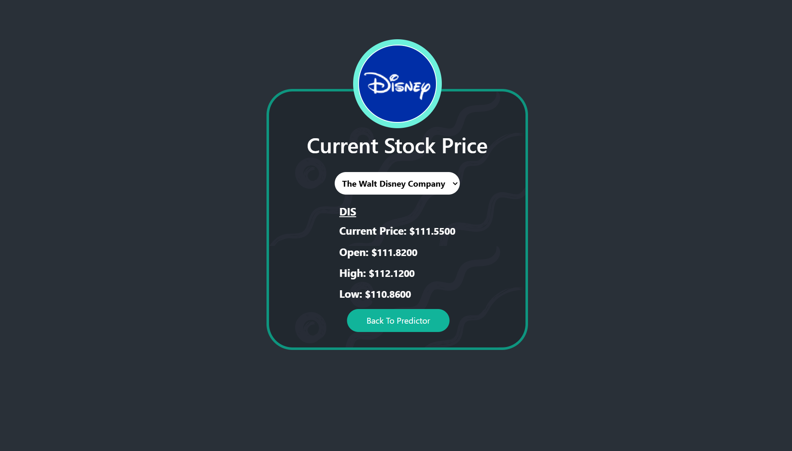
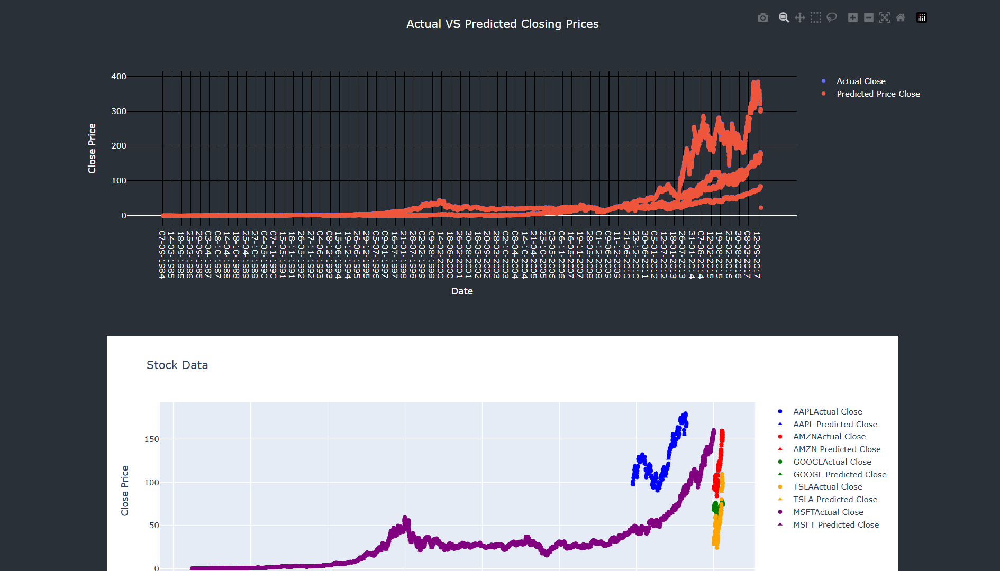

# 📈 Stock Price Prediction Web Application

This web application predicts stock closing prices using machine learning models and displays the results alongside interactive visualizations. Built using Flask for the backend and HTML, CSS, and Bootstrap for the frontend, the app is designed for easy use and scalability.

---

## 🚀 Features

- **Dynamic Prediction**: Displays the predicted closing price for a stock.
- **Interactive Visualizations**: Integrates Plotly graphs for detailed data analysis.
- **Modern UI**: Uses Bootstrap for a responsive and elegant interface.
- **Reusable Components**: Template-based design using Jinja2.

---

## 🔧 Technologies Used

- **Backend**: Flask (Python)
- **Frontend**: HTML, CSS, Bootstrap
- **Visualization**: Plotly
- **Styling**: Custom CSS for enhanced design

---

## 💻 Setup and Installation

### 1. Clone the Repository

```bash
git clone https://github.com/PrathameshJ-08/Foodash.git
cd close-price-predict
```

### 2. Create a Virtual Environment

```bash
python -m venv venv
source venv/bin/activate   # On Windows: venv\Scripts\activate
```

### 3. Install Required Dependencies

```bash
pip install -r requirements.txt
```

### 4. Run the Application

```bash
flask run
```

### 5. Access the Application

Visit `http://127.0.0.1:5000/` in your web browser.

---

## 📂 Project Structure

```
close-price-predict/
│
├── static/
│   ├── styles.css          # Custom CSS for styling
│
├── templates/
│   ├── layout.html         # Base HTML layout
│   └── index.html          # Main page for predictions
│
├── app.py                  # Main Flask application
├── model.py                # Machine learning model script
├── requirements.txt        # Dependencies
└── README.md               # Project documentation
```

---

## 🔍 Usage

1. Enter stock details (if applicable) on the UI.
2. View the predicted closing price displayed dynamically.
3. Explore interactive visualizations for deeper insights.

---

## 📸 Screenshots

<div style="display: grid; grid-template-columns: repeat(2, 1fr); gap: 10px;">
  <div style="flex: 1;">
    
    
  </div>
  <div style="flex: 1;">
    
        
  </div>
</div>

---

## 💡 ideFuture Enhancements

- Add user authentication for personalized experiences.
- Extend predictions to include additional metrics (e.g., opening prices, trends).
- Integrate APIs for real-time stock data retrieval.

## 📦 Contributing

1. Fork the repository.
2. Create a feature branch (`git checkout -b feature-name`).
3. Commit your changes (`git commit -m "Add feature"`).
4. Push to the branch (`git push origin feature-name`).
5. Open a pull request.

---

## 📌 Acknowledgements

- [Bootstrap](https://getbootstrap.com/) for the responsive UI components.
- [Plotly](https://plotly.com/) for interactive visualizations.
- [Flask](https://flask.palletsprojects.com/) for the backend framework.
